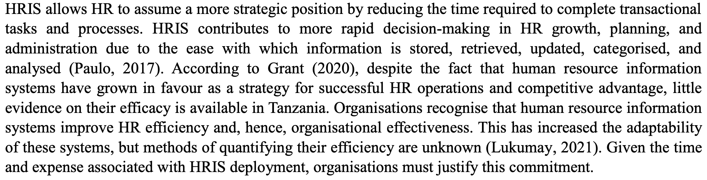

# Annotations  
(12/1/2025, 4:04:53 PM)

([R. and A., 2024, p. 1](zotero://select/library/items/7BQ9H994)) test

[Go to annotation](zotero://open-pdf/library/items/T884WUNB?page=2&annotation=9CMWLNBY) “human resources were incorporated into t” ([R. and A., 2024, p. 2](zotero://select/library/items/7BQ9H994))

([R. and A., 2024, p. 2](zotero://select/library/items/7BQ9H994)) test

[Go to annotation](zotero://open-pdf/library/items/T884WUNB?page=2&annotation=URWLP7C8) “Department surpassed other computer-access work categories as a major consumer of the day's expensive computing equipment. During this time, HRIS systems were computerised and well established in size and breadth, but basic record-keeping methods survived (Sadiq et al., 2022)” ([R. and A., 2024, p. 2](zotero://select/library/items/7BQ9H994))

[Go to annotation](zotero://open-pdf/library/items/T884WUNB?page=2&annotation=BGLS9FIG) “The majority of them continue to rely on physical communication methods such as parcel delivery. Organisations must completely adopt HRIS to satisfy the changing demands of the firm, including employee performance,” ([R. and A., 2024, p. 2](zotero://select/library/items/7BQ9H994))

[Go to annotation](zotero://open-pdf/library/items/T884WUNB?page=2&annotation=HVCL489L) “Efficient human resource management is a crucial concern for every learning institution seeking to maintain a competitive advantage in today's changing economy. Today's learning institutions encounter several uncertainties and shocks that have an impact on how firms run. Globalisation, ever-changing and innovative technical developments, changing roles within and within companies, ever-growing and active trade unions, uncertain economic and political contexts, and ethical and environmental challenges affecting enterprises are just a few examples (Sixtus, 2022).” ([R. and A., 2024, p. 2](zotero://select/library/items/7BQ9H994))

  
[Go to annotation](zotero://open-pdf/library/items/T884WUNB?page=2&annotation=7G8CQJPF)  
([R. and A., 2024, p. 2](zotero://select/library/items/7BQ9H994))

[Go to annotation](zotero://open-pdf/library/items/T884WUNB?page=2&annotation=W6SWM4FE) “HRIS allows HR to assume a more strategic position by reducing the time required to complete transactional tasks and processes. HRIS contributes to more rapid decision-making in HR growth, planning, and administration due to the ease with which information is stored, retrieved, updated, categorised, and analysed (Paulo, 2017). According to Grant (2020), despite the fact that human resource information systems have grown in favour as a strategy for successful HR operations and competitive advantage, little evidence on their efficacy is available in Tanzania. Organisations recognise that human resource information systems improve HR efficiency and, hence, organisational effectiveness. This has increased the adaptability of these systems, but methods of quantifying their efficiency are unknown (Lukumay, 2021). Given the time and expense associated with HRIS deployment, organisations must justify this commitment.” ([R. and A., 2024, p. 2](zotero://select/library/items/7BQ9H994))